🇷🇺 Специализируюсь в области вычислительной химии, включая методы квантовой химии, молекулярной динамики и молекулярного докинга. Обладаю базовыми навыками в сфере биоинформатики и ГИС. Использую Python для автоматизации рутинных задач и разработки вспомогательного программного обеспечения.

🇬🇧 I specialize in computational chemistry, including quantum chemistry, molecular dynamics, and molecular docking. I have basic skills in bioinformatics and GIS. I use Python to automate routine tasks and develop supporting software.

* ✉️ **E-mail:** [ekashirokova@gmail.com](mailto:ekashirokova@gmail.com)
* 📝 **ORCID:** [0000-0002-6252-5158](https://orcid.org/0000-0002-6252-5158)

